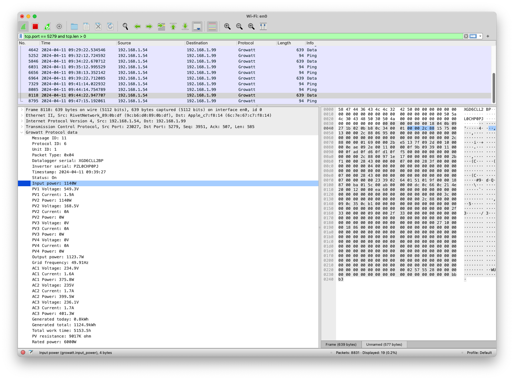
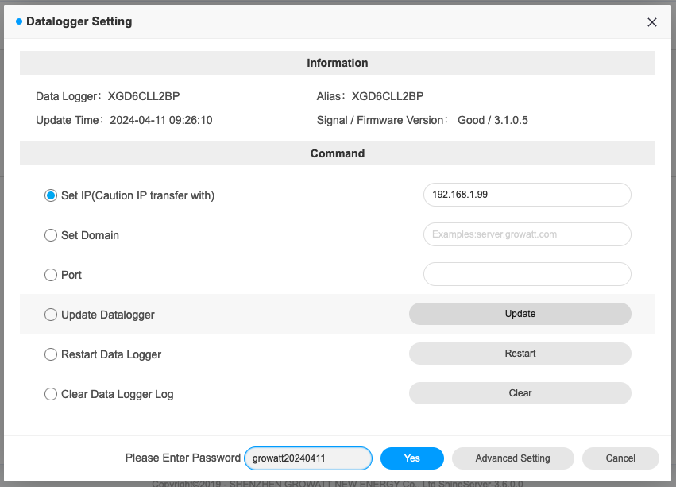

This provides a [Wireshark dissector] for decoding data produced by [Growatt]
solar inverters.

## Functionality

This will (partially) dissect the Growatt data packets and display what's
inside. It will also unscramble the data, as the data is sent in a format
scrambled/encoded format.



This is based on reverse engineering the protocol by comparing values to what's
reported by Growatt. A lot of data is missing - I'm not sure what it means (PRs
welcome!). This also only supports ping and data/buffered data packets.

I take zero responsibility for anything being correct. I think it is, but this
is all guesswork.

## Installation

Copy `growatt.lua` to the [Wireshark plugin folder]
(`~/.local/lib/wireshark/plugins` on MacOS). Create the folder if it doesn't
exist.

When installed, reload the lua plugins with cmd-shift-l or ctrl-shift-l.

You can now look at the [sample data](./data) to see how this works.

## Redirecting traffic

By default, the wifi module will send data directly to Growatt's server at
`server.growatt.com` (`47.91.67.66`). The easiest way to look at this data is
by redirecting the traffic through a Linux host that's configured to forward
the data to the original destination.

The datalogger here is the wifi dongle that's attached to the inverter.

```
┌──────────┐   ┌──────────────┐       ┌──────────────┐   ┌──────┐
│ Inverter │──▶│  Datalogger  │──────▶│Growatt server│──▶│ App  │
└──────────┘   └──────────────┘       └──────────────┘   └──────┘
                       │                      ▲
                       │   ┌─────────────┐    │
                       └──▶│Linux machine│────┘
                           └─────────────┘
```

### Configure forwarding

We can accomplish this by configuring iptables to route the traffic. First, on
the Linux machine, add a DNAT rule to forward the incoming traffic on port
5279:

```sh
# Enable IP forwarding
sysctl -w net.ipv4.ip_forward=1

# Add DNAT rule to forward traffic to the original destination
iptables -t nat -A PREROUTING -p tcp --dport 5279 -j DNAT --to-destination "47.91.67.66:5279"

# Masquerade for outgoing traffic so it looks like it originated from the
# its own IP.
iptables -t nat -A POSTROUTING -j MASQUERADE
```

### Change target

> ⚠️ Warning! If you make a mistake here, you won't be able to talk to your
> datalogger again. There may be ways to fix this (hard reset), but I'm not
> sure how. You've been warned, double check all settings before proceeding.

Now that traffic is forwarded, we can update the datalogger to send traffic here instead.

Log in at https://server.growatt.com/login, go to "All Devices" and click
"Datalogger Settings". Now update the IP to the linux host. In order to update
the setting, we need to provide a password. This password is `growatt<date>`,
where `<date>` is the current date as `YYYYMMDD`.



When configured, you can run Wireshark on the linux machine to look at the
traffic. Use this filter to remove some of the noise: `tcp.port == 5279 and
tcp.len > 0`.

### MacOS

If you would rather like to view the traffic on another host (such as the Linux
machine being a Raspberry Pi), you can copy the traffic to another machine.

On the Linux machine, add a tee target:

```sh
# Update this to the machine you want to redirect traffic to.
destination_ip=192.168.1.60

# Flush existing rules
iptables -F
iptables -t nat -F
iptables -t mangle -F

# Enable IP forwarding
sysctl -w net.ipv4.ip_forward=1

# Add TEE rule to duplicate traffic to the local destination
iptables -t mangle -A PREROUTING -p tcp --dport 5279 -j TEE --gateway "$destination_ip"

# Add DNAT rule to forward traffic to the original destination
iptables -t nat -A PREROUTING -p tcp --dport 5279 -j DNAT --to-destination "47.91.67.66:5279"

# Masquerade for outgoing traffic so it looks like it originated from the
# its own IP.
iptables -t nat -A POSTROUTING -j MASQUERADE
```

Now you can open up Wireshark on MacOS instead and look at the traffic there.


[Wireshark dissector]: https://wiki.wireshark.org/Lua/Dissectors
[Growatt]: https://en.growatt.com/
[Wireshark plugin folder]: https://www.wireshark.org/docs/wsug_html_chunked/ChPluginFolders.html
